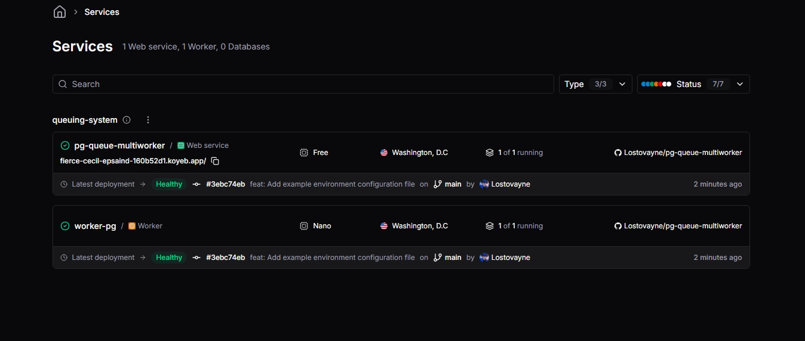

# 🚀 Postgres Queue System con Bun & Graphile Worker

<div align="center">



[](https://bun.sh)
[](https://www.postgresql.org)
[](https://www.typescriptlang.org/)
[](https://worker.graphile.org/)

</div>

## 📖 Descripción

Este proyecto implementa un sistema robusto y escalable de colas de tareas (Background Jobs) utilizando **PostgreSQL** como backbone y **Graphile Worker** para el procesamiento. Desarrollado con **Bun** para maximizar el rendimiento y la velocidad de ejecución.

El sistema está diseñado para manejar altas cargas de trabajo, garantizando la persistencia, reintentos automáticos y monitoreo en tiempo real de las tareas.

## ✨ Características Principales

- **Alto Rendimiento**: Construido sobre el runtime Bun.
- **Persistencia Confiable**: Uso de PostgreSQL para asegurar que ningun trabajo se pierda.
- **Escalabilidad**: Arquitectura lista para desplegar workers distribuidos.
- **Monitoreo en Tiempo Real**: Scripts incluidos para observar el estado de la cola y métricas de procesamiento.
- **Pruebas de Estrés**: Herramientas integradas para simular cargas masivas y verificar estabilidad.

## 🛠️ Stack Tecnológico

- **Runtime**: Bun
- **Base de Datos**: PostgreSQL
- **Server**: Express
- **Queue Engine**: Graphile Worker
- **Validación**: Zod

## 🚀 Instalación y Configuración

### Prerrequisitos

- [Bun](https://bun.sh) (v1.0+)
- PostgreSQL

### 1. Clonar el repositorio

```bash
git clone <tu-repo>
cd queue-postgresql
```

### 2. Instalar dependencias

```bash
bun install
```

### 3. Variables de Entorno

Copia el archivo de ejemplo y configura tu conexión a base de datos:

```bash
cp .env.example .env
```

Asegúrate de configurar `DATABASE_URL` y otras variables según tu entorno.

## 💻 Uso

### Servidor de Desarrollo

Inicia la API principal:

```bash
bun run dev
```

### Workers

Inicia el proceso de worker para consumir las tareas:

```bash
bun run worker:dev
```

## 🧪 Scripts y Pruebas

El proyecto incluye una suite de scripts automatizados ubicados en la carpeta `scripts/` para pruebas y mantenimiento.

### Pruebas de Estrés (Stress Testing)

Ejecuta una carga constante de trabajos para evaluar el rendimiento:

```bash
# Test de estrés estándar
bun run test:stress:const

# Test específico (1000 jobs, concurrencia 3)
bun run test:stress:5000
```

### Pruebas en Cloud

Para validar el despliegue en un entorno de nube:

```bash
bun run cloud:stress
```

### Monitoreo

Vigila el estado de la cola en tiempo real (Jobs pendientes, fallidos, completados):

```bash
bun run queue:watch
```

## 📂 Estructura del Proyecto

```
queue-postgresql/
├── 📂 scripts/           # Scripts de utilidad y testing
│   ├── cloud-stress-test.ts
│   ├── queue-stats-watch.ts
│   └── test-queue.ts
├── 📂 src/               # Código fuente principal
│   ├── app.ts            # Entry point de la API
│   ├── worker.ts         # Entry point del Worker
│   └── ...
├── 📂 resources/         # Assets y recursos estáticos
├── package.json
└── README.md
```

## 🤝 Contribución

Las contribuciones son bienvenidas. Por favor, abre un issue o envía un PR para mejoras.

---

<div align="center">
  <sub>Desarrollado con ❤️ usando Bun & Postgres</sub>
</div>
